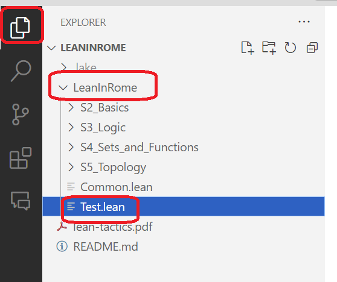
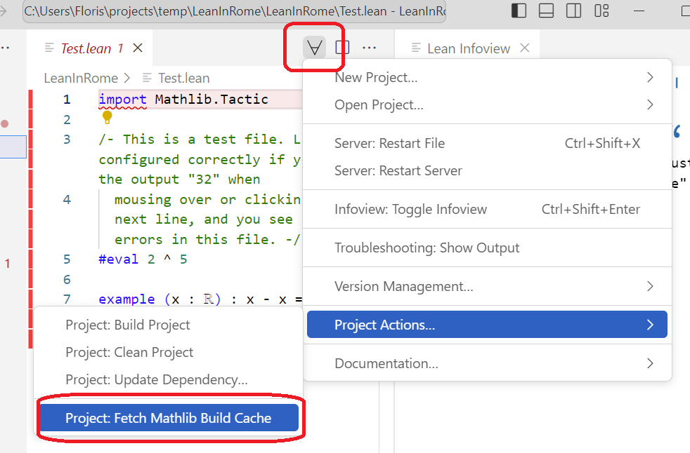

# Collaborative Analysis Formalisation seminar
For the course at Bonn SuSe 24.

## Installation

Note: To get this repository, you will need to download Lean's mathematical library, which takes about 5 GB of storage space.

* You have to install Lean, and two supporting programs: Git and VSCode. Follow these [instructions](https://leanprover-community.github.io/get_started.html) to do this. You do not have to follow the last step (creating Lean projects). Instead, use either VSCode or a terminal to get this repository.

### Get the Repository using VSCode

* Open Visual Studio Code
* Press `Clone Git Repository` (if you don't see the welcome screen, you can press `ctrl+shift+P` (or `cmd+shift+P` on Mac), type `Git: Clone` and press `enter`)
* Type `https://github.com/fpvandoorn/BonnAnalysis.git` and press enter

* Choose a folder where you want to clone this repository (everything will be placed in a subfolder `BonnAnalysis`).
* Press `open` when asked if you want to open the cloned repository
* Open the file `BonnAnalysis/Test.lean` using the explorer button in the top-right. Do **not** press `Restart Lean` or `Rebuild Imports` when these pop-ups show up. (If you do, you will rebuild mathlib yourself, which is not recommended)

* In the top-middle (or top-right) of the screen there is a Lean menu marked by `∀`.
  In it, choose `Project Actions... > Project: Fetch Mathlib Build Cache`.
  This downloads mathlib, and will take a bit of time.

* Once this is finished, press the `Rebuild Imports` button. The file should be ready a few seconds later. If you see a blue squiggle under `#eval`, Lean is running correctly.

### Get the Repository using a terminal

* Open a terminal (I recommend `git bash` on Windows, which was installed as part of git in the first step).

* Use `cd` to navigate to a directory where you would like to create the `BonnAnalysis` folder.

* Run `git clone https://github.com/fpvandoorn/BonnAnalysis.git`.

* Run `cd BonnAnalysis`

* Run `lake exe cache get!`
  * This downloads mathlib, and will take a bit of time
  * On Windows, if you get an error that starts with `curl: (35) schannel: next InitializeSecurityContext failed` it is probably your antivirus program that doesn't like that we're downloading many files. The easiest solution is to temporarily disable your antivirus program.

* Run `lake build +BonnAnalysis.Common`
  * This should take less than 1 minute. If you get more than a few lines of output, then you're rebuilding Mathlib from scratch, which means that the previous step went wrong. You can quit the execution and ask for help.

* Launch VS Code, either through your application menu or by typing
  `code .` (note the dot!). (MacOS users need to take a one-off
  [extra step](https://code.visualstudio.com/docs/setup/mac#_launching-from-the-command-line)
   to be able to launch VS Code from the command line.)

* If you launched VS Code from a menu, on the main screen, or in the File menu,
  click "Open folder" (just "Open" on a Mac), and choose the folder
  `BonnAnalysis` (*not* one of its subfolders).

* Test that everything is working by opening `BonnAnalysis/Test.lean`.
  It is normal if it takes 10-60 seconds for Lean to start up.